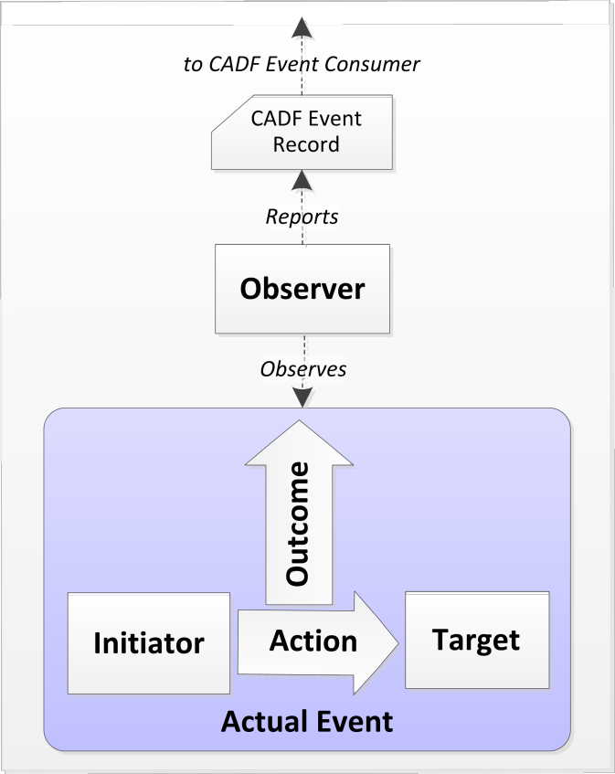

# Cloud Auditing Data Federation Standard

[Cloud Auditing Data Federation](https://www.dmtf.org/standards/cadf) (CADF) standard defines an event model, record format,
and interface definition for registering, exchanging, and reporting on security-related
events in cloud and hybrid environments. The standard prescribes 

## Event Model

CADF event model describes interactions between components and resources of an IT
system. It represents any auditable event as seen by a particular resource -- Observer,
whose responsibility is to create an event record. Each event has two other resources: 
Initiator and Target. The Initiator performs an Action upon the Target; that Action 
produces an Outcome. This model is schematically represented in the following 
diagram:

_Image copyright 2014 DMTF._

Initiator, Target, and Observer do not need to be separate resources; depending
on the particular scenario a resource can play more than one role in this model.

Each event has a type chosen from a predefined, extendable taxonomy. Resource and 
action types also come from predefined taxonomies, which enables consistent discovery
and reporting of events. 

## Event Record Serialization Format

The standard does not prescribe the format in which CADF events are recorded. XML and JSON are most commonly used for transmitting events, however, developers may choose to use other formats, such as Avro, for performance and storage efficiency, provided that all event properties have data types and formats as prescribed by the standard and are retained without modification. 

Examples in this guide use the JSON format.

## CADF Event Records

This section briefly describes most important properties of CADF events. Please refer to the [standard specification](https://www.dmtf.org/standards/cadf) for additional details and formal definitions.

Each CADF event record must contain the following main elements (properties):

- Entity type  URI `typeURI` "http://schemas.dmtf.org/cloud/audit/1.0/event". This property is required for JSON serialization of an event but is implied from the XML schema in XML serialization.
- Universally unique event identifier `id`.
- Event type `eventType`; while the CADF standard allows one of these values: "monitor", "activity", or "control", for the purposes of logging access to PHI only "activity" is an appropriate type.
- Timestamp `eventTime` in the ISO format, including the timezone information.
- Identification of three **resources**: Initiator `initiator`, Target `target`, and Observer `observer` (more on these later).
- Action `action` attempted by the Initiator, chosen from the standard taxonomy or its extension.
- Outcome `outcome` of the Action, chosen from the standard taxonomy or its extension.

Among the optional properties the most useful is `tags`: an array of strings, each of them conforming to a URI syntax, that allow the observer to further categorize and classify events, providing an application-specific view of event data. Tags can represent any data that developers consider useful in their application; things like user session identifiers, transaction IDs, etc. that allow correlation of various events along different dimensions are good candidates for inclusion in tags.

CADF specification allows extension of the base event entity and its complex properties by adding application-specific properties; however, applications should not extend standard types without a very good reason, to maintain interoperability.

### CADF Event Properties

In this section, we will discuss in detail some of the common CADF properties.

**Event type**

Most commonly events that are subject to logging for regulatory compliance are of type "activity", because Observer is reporting occurring activities. As an example, a human user (**Initiator**) trying to read an application web page (**Target**) is recorded by the application itself (**Observer**). If high granularity of logging is desired, events of the "control" type might be recorded by IAM and other access control services as a result of applying security and access policies correlated with "activity" events. Following the earlier example, if the web page access is denied to a user who has insufficient privileges, the fact that such policy has been applied might result in an additional "control" event. In that case the "activity" event would have the "failure" outcome, while the "control" event correlated to it would be a "success".

**Resources**

The **Initiator** is the entity that attempts to perform the **Action** upon the **Target**. The Initiator is typically a user or a service, while the Target, within the scope of this discussion, is most commonly a data resource being accessed. The **Observer** is the entity that reports the Action and its **Outcome**, issuing one or more CADF event records. 

Each resource must define the following properties:

- A universally unique `id`. This ID must remain consistent over time; different event records must not use different IDs for the same underlying resource.
- Resource `typeURI`. It should follow the taxonomy defined in Annex A.2 of the specification. Examples: "service/security/account/user" for a human user; "data/file" for a file; etc.
- `geolocation` -- an object that identifies geographical location of the resource with the maximum available precision.

The following properties are optional; adding them helps to identify resources and report on logged events:

- `name` -- an optional descriptive name of the resource; it is not necessarily unique.
- `host` -- an optional object wrapping the  resource `address`.
- `credential` -- an object wrapping the credential `type` used by the initiator; one of "apikey", "token", "user".

The `credential` property is only applicable to the Initiator resource.

You can find more examples on resource types [here](cadf-resource-types.md).

**Action**

Events of the "activity" type should use one of the [standard action verbs](cadf-actions.md) defined by the taxonomy, such as: "create", "read", "update" or "delete". 

**Outcome**

The `outcome` property value taxonomy can have one of the following values:

- "success" and "failure", with obvious meaning.
- "pending", which should be used when reporting on long-running actions or transactions, where one CADF event is emitted at the beginning of an activity and another correlated one upon the activity completion, reporting its actual outcome ("success" or "failure"). The absence of a correlated "success" or "failure" outcome can serve as an implicit indication of a failed transaction.
- "unknown", which should be used when the activity outcome is unlikely to be ever known, for example, when triggering an external action with no guaranteed completion, such as sending an email message.

**Reason**

The purpose of the optional `reason` object is to complement `outcome` with additional information that aids in troubleshooting and analytics. It has the following properties, which are domain-specific:

- `reasonType` -- a URI that defines the `reasonCode` domain, e.g. "HTTP" for HTTP result codes.
- `reasonCode` -- generally, a short alphanumeric code that details the reason of the event outcome, e.g. "401" for authorization failure.

Reason must be included in the "control" event records to indicate the specific reason, e.g. certain security policy, for a particular control outcome.

### Serialization samples

You can find an example of a CADF event, serialized as JSON, [here](cadf-ser-example.md).

