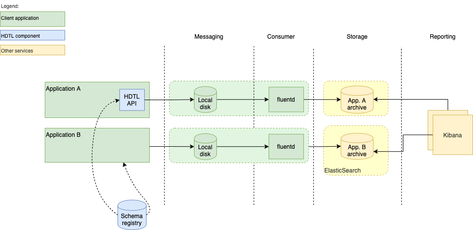
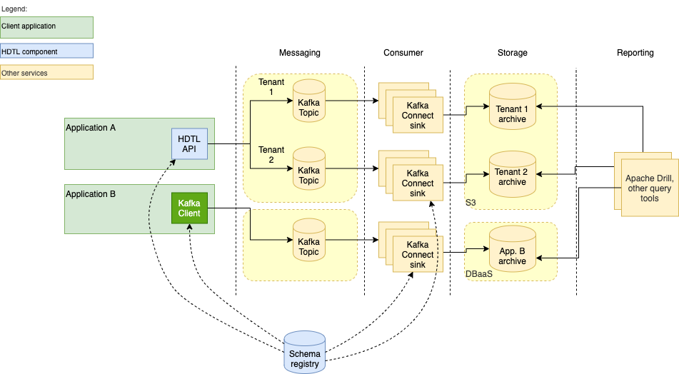

# HDTL Sample Deployment Architecture

This section provides some examples of deploying end-to-end PHI access audit logging. Which approach to choose depends very much on your application expected event rate, availability requirements, and its overall architecture and infrastructure layout.

The simpler approach might include writing  event records to a file in the application server file system, where it will be picked up by a log forwarder, such as fluentd, that will load events into a data store (e.g. Elasticsearch server). The application could use the HDTL audit logging API (future option, available later in 2021), as shown by _Application A_ in the diagram, or itself serialize event records, as _Application B_. The HDTL schema registry (future option) can be used to maintain record schemas for record validation and reference purposes.

.

This approach is also suitable for applications deployed on platforms that already provide log collection, such as IBM Kubernetes Service, RedHat Openshift, or IBM CloudPaks. However, in this case care should be taken to direct audit logs to a different destination from the rest of operational logs: audit logs will likely require additional security measures and their own access and retention policies.

Since event records are temporarily persisted in the local file system, deployment must ensure that the underlying storage is encrypted for audit data protection and redundant to avoid  data loss in case of infrastructure failure.

Applications with requirements of increased availability and event generation rate can benefit from a slightly more complex audit logging architecture, with a reliable high performance messaging service as the event record transport medium. Such an approach also allows separation of application tenants' data streams into individual transport channels and storage areas, which can be an important requirement for multi-tenant applications. Messaging, consumer, and storage infrastructure can be scaled up and down independently to support varying workload.

